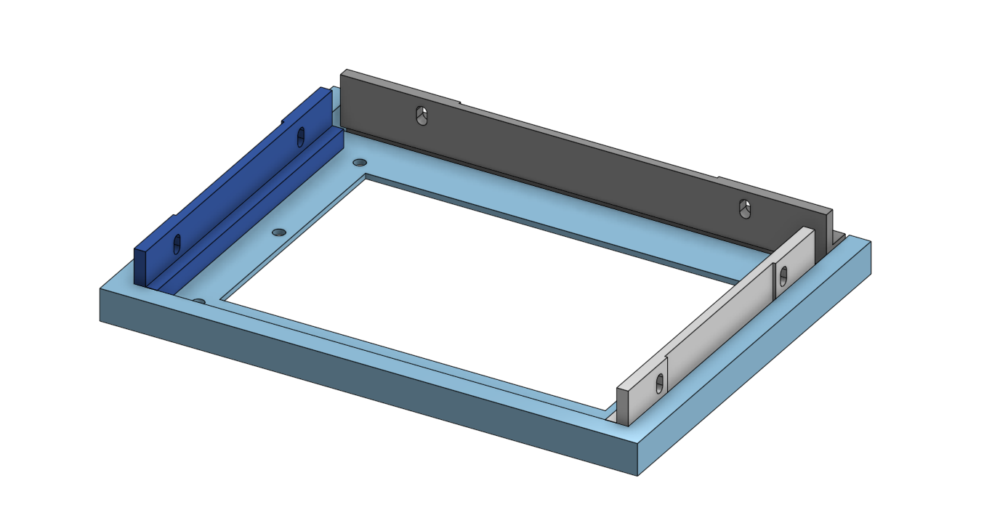
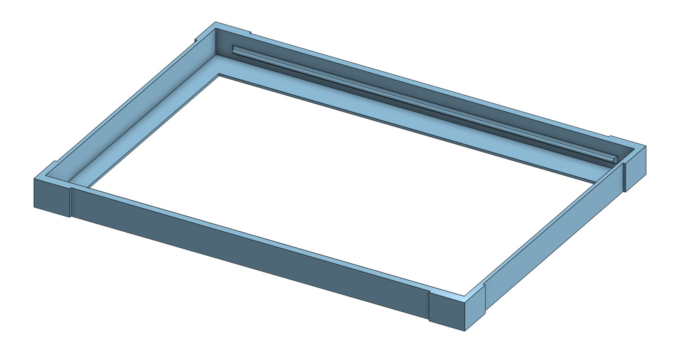
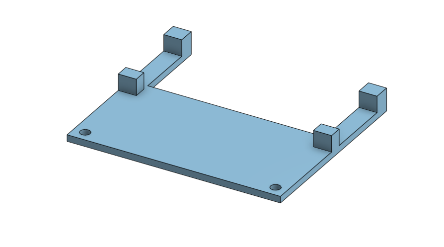

# 3D Models
These models can be added to an Ikea RÖDALM 7" frame to hold the display in place and mount it to the wall, while still allowing the frame to be easily removed to charge the battery.

If you wish to modify the files you can find them on [onShape](https://cad.onshape.com/documents/4913049a9a49f8f4cdaf3a0f/w/25e13eeb061b24291810236e/e/7fa965596a244ea4fc1d81bc?renderMode=0&uiState=6983d51955dd59293dddc37a).

## Files

- `batty_holder` - Holds the battery in place so it does not slide around or fall out
- `frame_insert` - Holder the Inky Impression in place and centered in the frame
- `pi_support` - Optional piece to install under the pi to stop any bending as it is only attached by the headers
- `wall_hanger-left_slide` / `wall_hanger-right_slide` - Side inserts that holder the frame to the wall mount
- `wall_hanger-top_cover` - Top piece to hide the gap between the top of the frame and the wall
- `wall_hanger-wall_mount` - The piece that is attached to the wall. All the other pieces are attached to the RÖDALM frame and allow it to slide onto this piece.

## Print Setting

All these parts can be printed in PLA and on any bed at least 200x200mm in size, such as the Bambu Lab A1 or Prusa Core One.

I printed using a .4mm nozzle with a .28mm layer height and 15% infill, but I don't see a reason you couldn't print these using a bigger nozzle.

Due to the overhangs, I would recommend using support for the slides, frame_insert and wall_hanger-wall_mount.

## Model images
Wall Hanger pieces sitting inplace

Frame insert

Pi support
