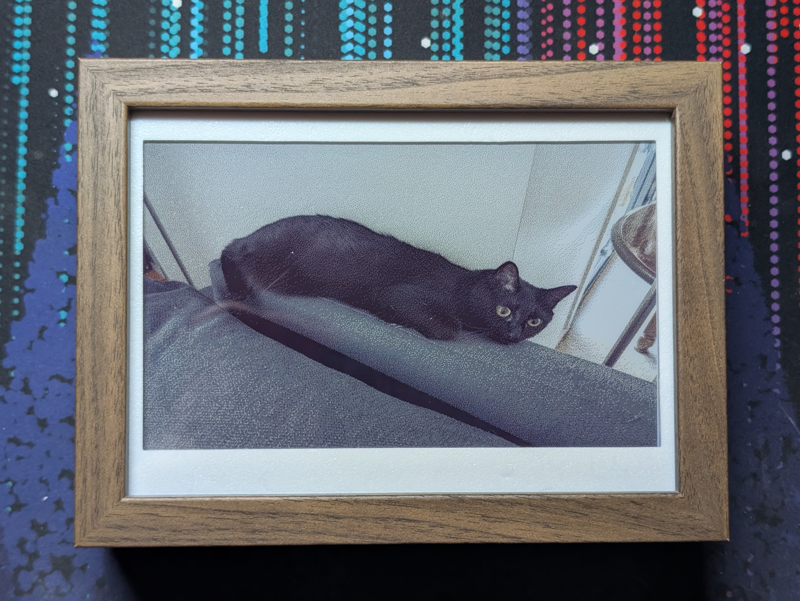
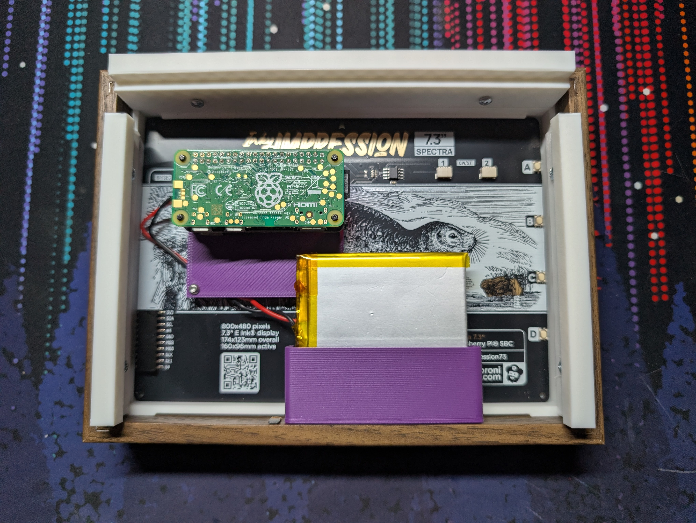

# eink-pictures
E-ink battery powered digital picture frame. Provides code to manage the scheduled power state and displaying images on the Inky Impression e-ink display using a Raspberry Pi Zero 2w on battery power.



By default, this script wakes the Pi 3 times a day (6am, 12pm and 6pm), runs for ~90 seconds to update the display,then powers off. When 5V is connected, the Pi stays powered on for maintenance and will shut itself down automatically when unplugged.

The repo also contains some 3D models for mounting the display and pi in an Ikea RÖDALM frame and mounting to the wall. These files can be printed in PLA with supports. If you wish to modify the files you can find them on [onShape](https://cad.onshape.com/documents/4913049a9a49f8f4cdaf3a0f/w/25e13eeb061b24291810236e/e/7fa965596a244ea4fc1d81bc?renderMode=0&uiState=6983d51955dd59293dddc37a).

## Hardware Required

### Display

- [Pimoroni Inky Impression Spectra 6 (7.3")](https://shop.pimoroni.com/products/inky-impression?variant=55186435244411)
- Raspbery Pi Zero 2W
- [Witty Pi 4 L3V7](https://www.uugear.com/product/witty-pi-4-l3v7/)
- (LiPo) 3.7V 2400mAh battery
- Raspberry Pi Extra-Long Stacking Header (2x20 pins)
- (optional) standoff screws
- Micro SD card (minimum 8GB)

### Picture frame

- 3D printed wall mount parts from `/3d-models` in this repo
- 8x 4Gx9mm self tapping screws
- Ikea RÖDALM 7" picture frame
- Screws/wall plugs to attach to your wall

## Software Setup

1. Pi Setup
   1. Use Raspberry Pi Imager to install Raspberry Pi OS Lite (64-bit) on your Micro SD Card.
        Make sure to set your network, hostname, and to enable SSH and user details here. For the purpose of these instructions the hostname will be `hostname` and the user `pi`.
   2. Insert the Micro SD Card into the Pi and power it on. First boot can take a minute so sit tight and wait for it to join your network.
   3. From your PC, SSH into your Pi using `ssh pi@hostname.local` and typing in your password. If you are using the default user of `pi` the password is `raspberry` and you should change it now.
   4. Optionally, take the time to save some battery power on the device for subsequent boots by disabling some features we don't need. They are small saving but every little bit helps.
      1. Edit `/boot/firmware/config.txt` to disable the camera, audio, the power LED and bluetooth.
         1. `sudo nano /boot/firmware/config.txt`
         2. Comment out the following lines by adding a `#` at the start of each one\
            dtparam=audio=on\
            camera_auto_detect=1\
            display_auto_detect=1
         3. Add this section to the bottom to disable the led
            ```
            # Disable the ACT LED on the Pi Zero.
            dtparam=act_led_trigger=none
            dtparam=act_led_activelow=on
        
            # Disable Bluetooth
            dtoverlay=disable-bt
            ```
         4. Press `ctl+x` and then `enter` to save your changed.
      2. Disable the bluetooth service from systemctl using `sudo systemctl disable bluetooth.service`
   5. Update apt by running `sudo apt update && sudo apt upgrade`
2. Display setup. This is the software provided by Pimoroni to control the Inky Impression.
   1. Install git `sudo apt install git`
   2. Install the Inky Library. When promoted, select the option to install the Python virtual environment, but do not install the examples or their dependencies.
      ```
      git clone https://github.com/pimoroni/inky
      cd inky
      ./install.sh
      ```
      If you see an error similar to the below, just ignore it.\
      `ERROR: pip's dependency resolver does not currently take into account all the packages that are installed. This behaviour is the source of the following dependency conflicts.types-seaborn 0.13.2 requires matplotlib>=3.8; python_version >= "3.9", which is not installed.types-seaborn 0.13.2 requires pandas-stubs, which is not installed.`
   3. Install the Fredoka One font from the python virtual environment.
      ```
      source ~/.virtualenvs/pimoroni/bin/activate
      pip3 install font-fredoka-one
      ```
   4. Reboot the pi `sudo reboot now` and then ssh back in.
3. Power Management Setup. This is the software for managing the WittyPi.
   1. Install the WittyPi firmware 
   
      `wget https://www.uugear.com/repo/WittyPi4/install.sh`
   2. Run the install command
    
      `sudo sh install.sh`
   3. Remove the installer script
      
      `sudo rm install.sh`
   4. Reboot your pi `sudo reboot now` and then ssh back in.
   5. Check that your pi has the correct system date using the `date` command. If it is wrong, fix it now.
   6. Run the WittyPi script `~/wittypi/wittyPi.sh`. This will show a menu with some actions to take.
      1. First, update the WittyPi system date using option `1`.
      2. Secondly, disable the pulsing LED when in sleep, as it's just a battery drain. Select option `11` and then `4` and set it to `0`.
      3. Exit the script using option `13`.
4. Management Software install. This is the custom scripts from this repository that handles the wake cycle and updating the display.
   1. Create a new directory called `pictures` in your home directory. This is where the photos to display will go.
   
      `mkdir ~/pictures`
   2. Clone this repo into your home folder.
   
      `git clone https://github.com/deAmber/eink-pictures.git`
   3. Copy `eink-power-watch@.service` to `/etc/systemd/system`
   
      `sudo cp ~/eink-pictures/eink-power-watch@.service /etc/systemd/system`
   4. Copy `eink-pictures-cycle@.service` to `/etc/systemd/system` and enable it.
      ```
      sudo cp ~/eink-pictures/eink-pictures-cycle@.service /etc/systemd/system
      sudo systemctl daemon-reload
      sudo systemctl enable eink-pictures-cycle@$(whoami).service
      ```
   5. Enable scripts to shut down the Pi, replacing `pi` with your username.
      ```
      sudo visudo -f /etc/sudoers.d/eink-frame
      pi ALL=(root) NOPASSWD: /sbin/shutdown
      ```
   6. Make sure the scripts are executable in the `eink-pictures` directory
   
      `chmod +x ~/eink-pictures/*.sh ~/eink-pictures/*.py`
   7. Copy `schedule.wpi` to the wittypi dir. It is set by default to update the picture 3 times a day (6am, 12pm, 6pm). [You can edit this as you see fit](https://www.uugear.com/app/wittypi-scriptgen/), but more frequent picture updates will use the battery faster.
   
      `cp ~/eink-pictures/schedule.wpi ~/wittypi/`
   8. Run the WittyPi scheduller to schedule your next boot
   
      `~/wittypi/runScript.sh`
5. Add pictures to the pi. The easiest way is to collect the photos you wish to use to a single folder on your main PC, and then use rsync to place them on the pi.

    Open a terminal window from the folder on your pc and use `rsync -v ./* pi@<pi-ip>:~/pictures/`, replacing `pi` with your username and the ip address with the one your pi is on.
6. Reboot your pi one last time. Everything should now be setup correctly and the pi should handle updating the display and turning itself off.

If the display is not updating, you can check that the scripts are running by checking the log file using `cat ~/eink_pictures.log`, or if the pi is on you can check the logs for just this cycle using `journalctl -u eink-pictures-cycle@$(whoami).service -b` and `journalctl -u eink-power-watch@$(whoami).service -b`

## Assembly

### Display

1. Connect the Pi Zero to the stacking headers and then slide the Witty Pi 4 on top, using the provided standoffs as spacers and to provide structural support.
2. If Installing in the frame, assemble the frame before continuing.
3. If desired, install the pi spacer 3D printed part by screwing into the standoff on the far side from the header on the Inky Impression. This just provides some support to the Pi to help it not bend when plugging in the power cable.
4. Install the Pi into the Inky Impression by pushing the stacking header in as far as it will go.

### 3D Printed Frame
This frame adds some space to fit the Witty Pi behind the frame as well as an interface for attaching the assembly to the wall. It is not required for the hardware to work and is completely optional.

1. 3D print all the parts for the wall attachment.
2. Take out the contents of the Ikea frame, reserving the plastic faceplate and bending the metal retention flaps up and flattening.
3. Drill pilot holes for the slides. Tip: sit them backwards so that the lip sits outside the frame and then mark the places for the screw holes. Make sure the slides are also sitting on the bottom inside edge of the frame. This will make sure they are in the correct position.
4. Drill pilot holes for the top cover and battery holder.
5. Insert the reserved plastic faceplate into the frame.
6. Place the Inky Impression in the Frame Insert by putting in the top edge and then sliding down the bottom one. It should be flush against the insert. Now slide the insert into the frame.
7. Screw in the top cover and then the slides, followed finally by the battery holder.
8. If you have not already installed the pi and battery, do so now. The inside of the frame should look like this.

   
9. Mount the Wall Mount to your wall as desired, ensuring the open side is at the top.
10. The Assembly should easily slide onto the wall mount, and can be removed by sliding up whenever it needs charging.

## References
- [Inky Impression Getting Started](https://learn.pimoroni.com/article/getting-started-with-inky-impression#running-the-built-in-examples)
- [WittyPi Manual](https://www.uugear.com/doc/WittyPi4L3V7_UserManual.pdf)
- [WittyPi Schedule Script Generator](https://www.uugear.com/app/wittypi-scriptgen/)